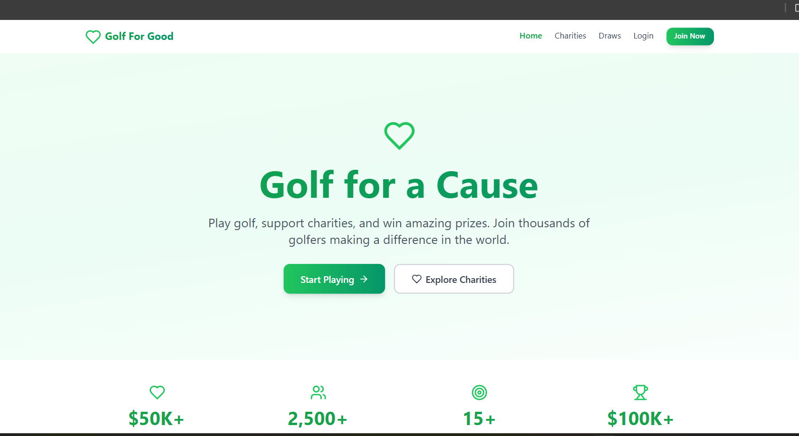
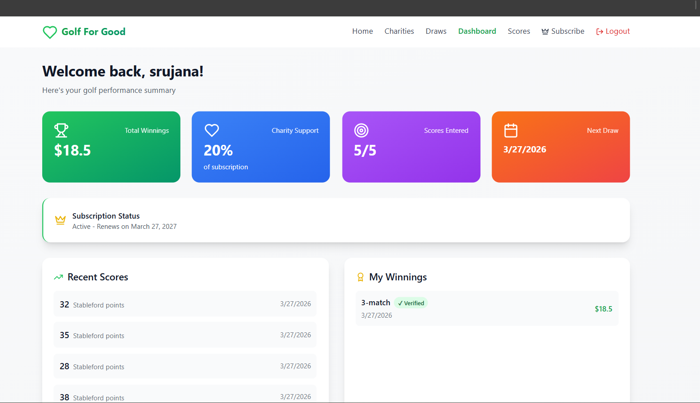
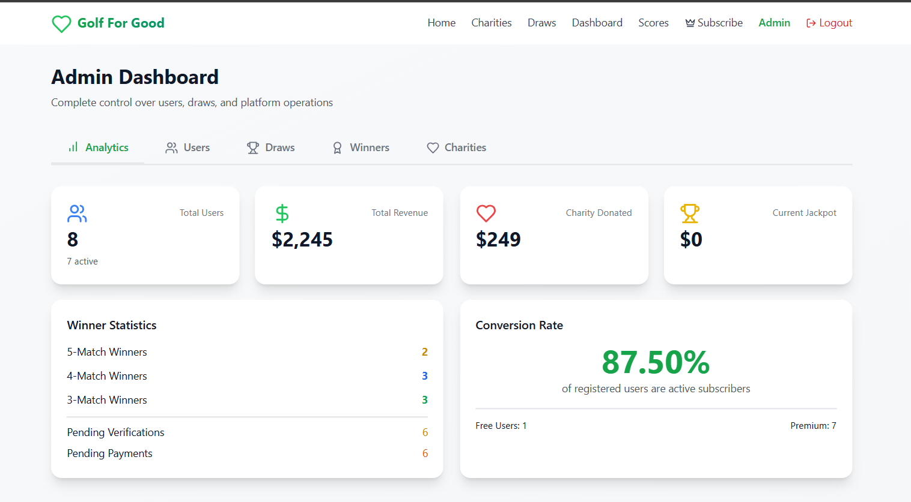
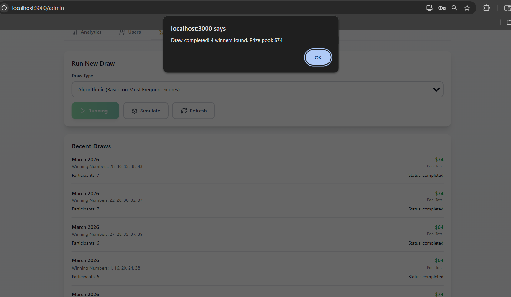
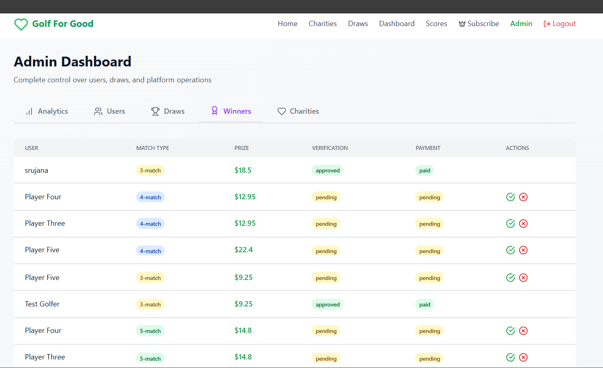
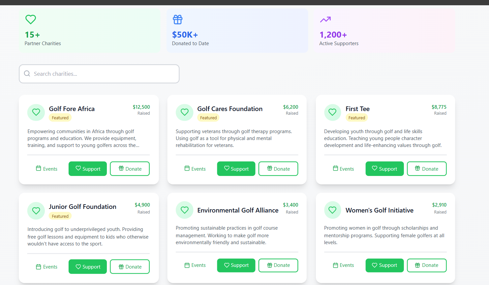
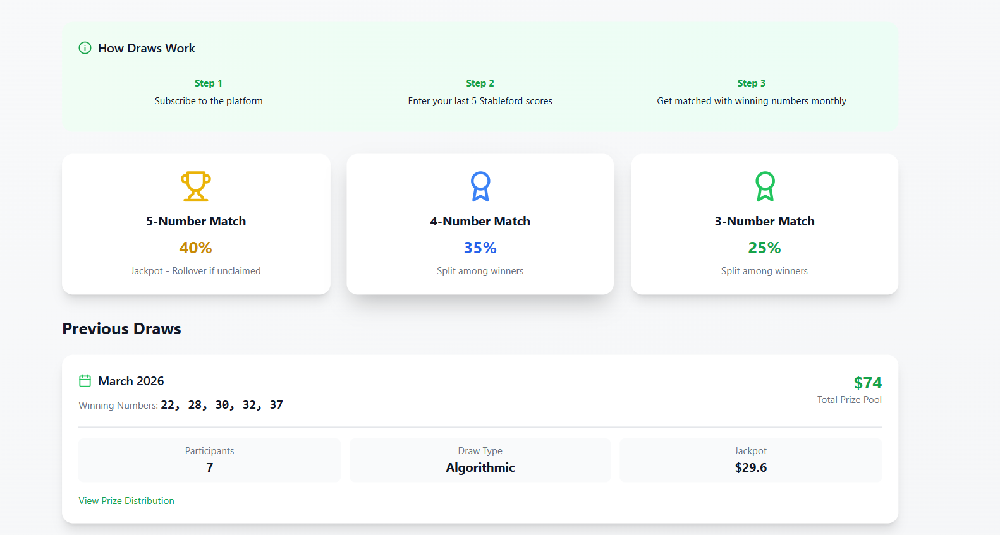
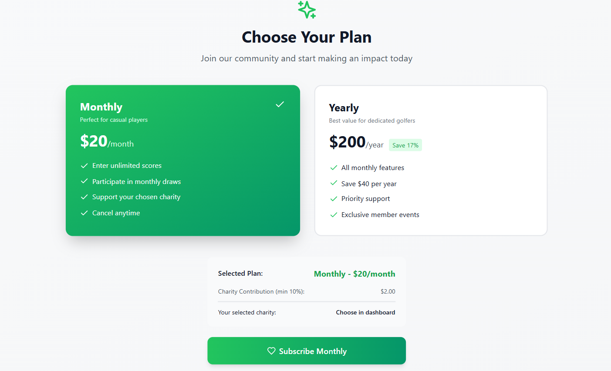

# ⛳ Golf For Good – Charity Subscription Platform


---

## 📌 Project Description

**Golf For Good** is a full-stack subscription-driven web application that combines golf performance tracking, charity fundraising, and monthly prize draws. Golfers can subscribe to the platform, track their Stableford scores, participate in monthly draws, and support their favorite charities—all while having a chance to win prizes.

This project demonstrates complete full-stack development with **React, Node.js, Express, Supabase**, and **Razorpay** payment integration.

---

## 🚀 Features

### ✅ Implemented Features

* **User Authentication** – JWT-based registration and login with bcrypt password hashing
* **Subscription Plans** – Monthly ($20) & Yearly ($200) with 17% savings
* **Payment Integration** – Razorpay payment gateway with signature verification
* **Score Management** – Stableford scoring (1-45) with 5-score rolling logic
* **Draw System** – Random & Algorithmic monthly draws with prize distribution
* **Prize Distribution** – 40/35/25 split with equal sharing for multiple winners
* **Jackpot Rollover** – Unclaimed 5-match prizes carry forward
* **Charity Support** – 10% minimum contribution, voluntary increase to 100%
* **Independent Donations** – One-time donations to any charity
* **Charity Events** – Add and view upcoming events (golf days, fundraisers)
* **Winner Verification** – Proof upload with admin approval workflow
* **Admin Dashboard** – Full control over users, draws, charities, and winners
* **Analytics** – Real-time statistics on users, revenue, donations, and winners
* **Mobile Responsive** – Fully responsive design with Tailwind CSS
* **Modern UI** – Emotion-driven design with animations, no golf clichés

---

## 🛠 Tech Stack

### 🖥 Frontend

| Technology | Purpose |
|------------|---------|
| React 18 | UI Library |
| Tailwind CSS | Styling |
| Framer Motion | Animations |
| Axios | HTTP Client |
| React Router DOM | Navigation |
| Lucide React | Icons |

### ⚙️ Backend

| Technology | Purpose |
|------------|---------|
| Node.js | Runtime |
| Express | Web Framework |
| JWT | Authentication |
| Bcrypt | Password Hashing |
| Multer | File Uploads |
| Nodemailer | Email Notifications |

### 🗄 Database

| Technology | Purpose |
|------------|---------|
| Supabase | PostgreSQL Database |
| Row Level Security | Data Protection |

### 💳 Payment

| Technology | Purpose |
|------------|---------|
| Razorpay | Payment Gateway |
| Signature Verification | Secure Transactions |

---

## 📂 Project Structure

```bash
golf-charity-platform/
├── client/                      # React Frontend
│   ├── src/
│   │   ├── pages/
│   │   │   ├── Home.js
│   │   │   ├── Login.js
│   │   │   ├── Register.js
│   │   │   ├── Dashboard.js
│   │   │   ├── Scores.js
│   │   │   ├── Charities.js
│   │   │   ├── Draws.js
│   │   │   ├── Admin.js
│   │   │   └── Subscription.js
│   │   ├── components/
│   │   │   ├── Navbar.js
│   │   │   └── PrivateRoute.js
│   │   ├── context/
│   │   │   └── AuthContext.js
│   │   └── App.js
│   ├── public/
│   ├── tailwind.config.js
│   └── package.json
├── server/                      # Node.js Backend
│   ├── routes/
│   │   ├── authRoutes.js
│   │   ├── paymentRoutes.js
│   │   ├── scoreRoutes.js
│   │   ├── drawRoutes.js
│   │   ├── charityRoutes.js
│   │   ├── adminRoutes.js
│   │   └── uploadRoutes.js
│   ├── middleware/
│   │   ├── auth.js
│   │   └── isAdmin.js
│   ├── controllers/
│   │   └── drawController.js
│   ├── server.js
│   └── package.json
├── database/
│   └── schema.sql               # Complete database schema
├── screenshots/                  # Application screenshots
├── README.md
└── .gitignore
```

---

## 📸 Screenshots

### Homepage

*Modern, emotion-driven design with heart icons and no golf clichés*


### User Dashboard

*Track scores, view winnings, and manage subscription*


### Admin Dashboard - Analytics

*Real-time statistics on users, revenue, and donations*


### Admin Dashboard - Draws

*Run random or algorithmic draws with simulation mode*


### Admin Dashboard - Winners

*Approve or reject winner proofs and mark payouts*


### Charities Page

*Browse and support charities with 10-100% contribution*


### Draws Page

*View draw mechanics and past results*


### Subscription Plans

*Monthly ($20) and Yearly ($200) plans with 17% savings*

---

## ⚙️ Installation

### 1️⃣ Clone the Repository

```bash
git clone https://github.com/sasichintada/golf-charity-platform.git
cd golf-charity-platform
```

### 2️⃣ Install Backend Dependencies

```bash
cd server
npm install
```

### 3️⃣ Install Frontend Dependencies

```bash
cd ../client
npm install
```

### 4️⃣ Configure Environment Variables

**Backend (`server/.env`):**
```env
PORT=5000
SUPABASE_URL=your_supabase_url
SUPABASE_SERVICE_KEY=your_service_key
JWT_SECRET=your_jwt_secret
RAZORPAY_KEY_ID=rzp_test_xxxxx
RAZORPAY_KEY_SECRET=your_secret
CLIENT_URL=http://localhost:3000
```

**Frontend (`client/.env`):**
```env
REACT_APP_API_URL=http://localhost:5000
REACT_APP_RAZORPAY_KEY=rzp_test_xxxxx
```

### 5️⃣ Setup Database

1. Create a new Supabase project
2. Run the SQL schema from `database/schema.sql` in Supabase SQL Editor
3. Update your `.env` with Supabase credentials

### 6️⃣ Run the Application

```bash
# Terminal 1 - Backend
cd server
npm run dev

# Terminal 2 - Frontend
cd client
npm start
```

---

## ▶️ Usage

### Test Credentials

| Role | Email | Password |
|------|-------|----------|
| Admin | admin@digitalheroes.co.in | Admin@123 |
| User | testwinner@example.com | test123 |

### Test Payment Details

- **Card Number**: `5267 0000 0000 0000`
- **Expiry**: `12/26`
- **CVV**: `123`
- **UPI**: `success@razorpay`

### User Flow

1. **Register** – Create a new account
2. **Subscribe** – Choose monthly or yearly plan, complete Razorpay payment
3. **Add Scores** – Enter your last 5 Stableford scores (1-45)
4. **Select Charity** – Choose a charity to support (10-100% contribution)
5. **Participate** – Automatically entered into monthly draws
6. **Win Prizes** – If your scores match draw numbers, you win
7. **Upload Proof** – Submit screenshot to verify your win
8. **Get Paid** – Admin approves and processes payment

### Admin Flow

1. **Login as Admin** – Access full admin dashboard
2. **Run Draws** – Configure random or algorithmic draws, simulate first
3. **Manage Users** – View, edit, and manage user subscriptions
4. **Manage Charities** – Add, edit, delete charities and events
5. **Verify Winners** – Review proof uploads, approve or reject
6. **Mark Payouts** – Process payments for verified winners
7. **View Analytics** – Track users, revenue, donations, and winners


---

## 👩‍💻 Author

**Sasi Chintada**  

- Project: [Golf Charity Platform](https://github.com/sasichintada/golf-charity-platform)

---

## 📄 License

This project is licensed under the MIT License - see the [LICENSE](LICENSE) file for details.

---

## 🙏 Acknowledgments

- **Digital Heroes** – For the PRD and selection process
- **Razorpay** – For the payment gateway
- **Supabase** – For the PostgreSQL database
- **Tailwind CSS** – For the styling framework

---
